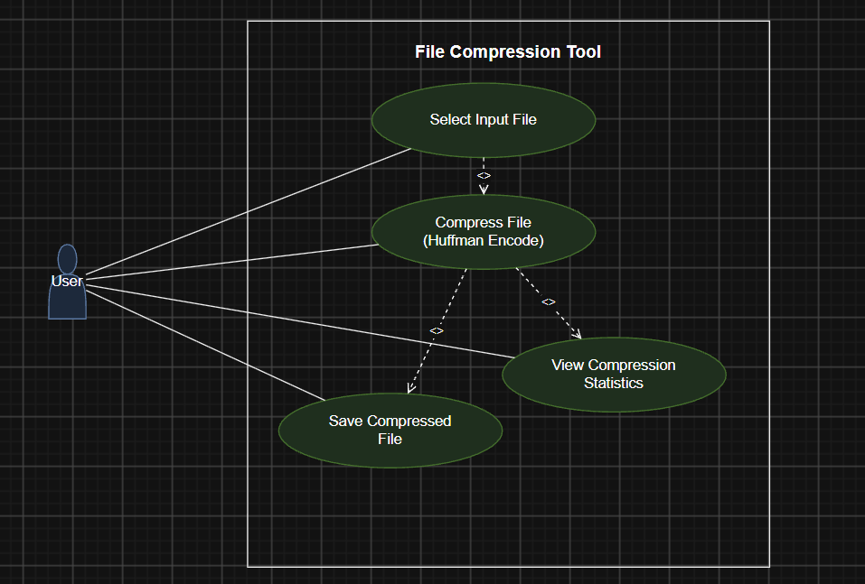

**Software Requirements Specification (SRS)**

**Project:** File Compression Tool (Basic ZIP Implementation)

**Technology:** C / C++

**Version:** 1.0

**Author:** TEAM 5

**Date:** 06-09-2026

**Status:** Draft

**Revision History**

| **Version** | **Date**   | **Author** | **Change Summary**                                                                          | **Approval** |
|-------------|------------|------------|---------------------------------------------------------------------------------------------|--------------|
| 1.0         | 06-09-2026 | TEAM 5     | Initial SRS for Huffman-coding based file compression tool (compression and decompression). |              |

**Approvals**

| **Role**           | **Name**    | **Signature / Email** | **Date** |
|--------------------|-------------|-----------------------|----------|
| Course Coordinator | Sheela Devi |                       |          |

**Table of Contents**

> 1\. Introduction
>
> 2\. Overall Description
>
> 3\. External Interface Requirements
>
> 4\. System Features (Detailed)
>
> 5\. Non-Functional Requirements (Detailed)
>
> 6\. Security
>
> 7\. Quality Attributes & Acceptance Tests
>
> 8\. System Models and Diagrams (UML Use-Case Diagrams)
>
> 9\. Requirements Traceability Matrix (RTM)

**1. Introduction**

> **1.1 Purpose**
>
> This Software Requirements Specification (SRS) defines the functional and non-functional requirements for a basic File Compression Tool implemented in C/C++. The tool uses Huffman coding to reduce file size and supports compression and decompression of files through a simple command-line interface (CLI). This document is intended to guide design, implementation, and testing, and to serve as an evaluation reference for course instructors.
>
> **1.2 Scope**
>
> The system covers: reading an input file, calculating byte/character frequencies, constructing a Huffman tree, generating variable-length prefix codes, encoding data into a compressed bitstream, writing the metadata needed for decoding, and restoring the original file through decompression. The project is a basic, self-contained ZIP-like compression utility and does not aim to reproduce the full ZIP file-format specification or interoperate with standard ZIP archives.
>
> **1.3 Audience**
>
> Students, developers, testers, course instructors, and evaluators.
>
> **1.4 Definitions, Acronyms and Abbreviations**

- Huffman Coding: A prefix-code algorithm that assigns shorter bit codes to more frequent symbols and longer codes to less frequent symbols.

- Compression: Reducing the number of bits required to represent file data.

- Decompression: Reconstructing the original file from compressed data.

- Bitstream: A sequence of bits used to store Huffman-coded data.

- Header / Metadata: Information stored with a compressed file (e.g. frequency table) that is needed to decode it.

- CLI: Command-Line Interface.

- ZIP-like: A basic compression utility inspired by common archive tools, without claiming full ZIP-format compatibility.

**2. Overall Description**

> **2.1 Product Perspective**
>
> The File Compression Tool is a standalone C/C++ desktop utility that operates on files available on the local file system. It has no dependency on an external server, network service, or database. Its main components are: file input/output handling, frequency analysis, Huffman-tree construction, code-table generation, bit-level encoding/decoding, compressed-file (header + bitstream) storage, and decompression/reconstruction.
>
> **2.2 Major Product Functions**

- Accept a file selected by the user for compression.

- Read the input file in binary mode without altering it.

- Calculate the frequency of each byte/symbol in the input.

- Construct a Huffman tree from the frequency table.

- Generate prefix-free Huffman codes for each symbol.

- Encode the input data into a compressed bitstream.

- Store the metadata/header required for decoding in the compressed output.

- Create a compressed output file with a defined extension (e.g. .huff).

- Accept a compressed file for decompression.

- Read and validate the compressed file's header/metadata.

- Reconstruct the Huffman decoding structure from stored metadata.

- Decode the bitstream and recreate the original byte sequence.

- Report basic compression statistics (original size, compressed size, ratio) to the user.

- Detect invalid paths, unreadable files, and invalid/corrupted compressed files.

- Avoid overwriting an existing output file unless explicitly confirmed by the user.

> **2.3 User Roles and Characteristics**
>
> User: A person with basic knowledge of files and command-line programs who supplies an input file and selects compression or decompression.
>
> Developer / Tester: Maintains the implementation and verifies functional, performance, reliability, and security requirements.
>
> Evaluator: Reviews whether the implementation satisfies the requirements and acceptance tests defined in this SRS.
>
> **2.4 Operating Environment**
>
> The system runs as a standalone C/C++ console program on a desktop/laptop operating system (Windows/Linux) with a standard C/C++ compiler (e.g. GCC/G++, MSVC) and standard file-system APIs. It must correctly handle binary files, not just text files.
>
> **2.5 Constraints**
>
> The project is limited to Huffman coding as the primary compression algorithm. It is a basic ZIP-like implementation and is not required to be compatible with standard ZIP archives. Available memory and storage depend on the host computer. Correct bit-level handling and lossless preservation of binary data are mandatory.

**3. External Interface Requirements**

> **3.1 User Interfaces**
>
> The primary interface is a command-line interface (CLI). The program shall provide clear command syntax/prompts for compression and decompression, input/output file paths, success messages, error messages, and basic compression statistics.
>
> **3.2 Hardware Interfaces**
>
> No dedicated hardware interface is required. The system uses the host computer's storage device and processor through standard operating-system facilities.
>
> **3.3 Software Interfaces**
>
> The tool uses standard C/C++ libraries and file I/O facilities only. No external server, database, or third-party service is required.
>
> **3.4 File / Communication Interfaces**
>
> Input and output are local files only; no network communication is required. The compressed file shall contain sufficient metadata (e.g. the frequency table or equivalent Huffman-tree information) to identify and decode the valid encoded bitstream.

**4. System Features (Detailed)**

> Each requirement below includes acceptance criteria and a reference test case. Requirement IDs follow FCT-F-###.
>
> **4.1 File Input and Frequency Analysis**
>
> Description: Accept and read the input file safely, then compute symbol frequencies used to build the Huffman tree.

| **Req ID** | **Requirement (shall...)**                                                                                             | **Type**   | **Priority** | **Source** | **Acceptance Criteria / Test Ref**                                  | **Comments / Dependencies**  |
|------------|------------------------------------------------------------------------------------------------------------------------|------------|--------------|------------|---------------------------------------------------------------------|------------------------------|
| FCT-F-001  | The system shall accept a valid input file path for compression.                                                       | Functional | High         | User       | Valid file is accepted and processing begins. TC-COMP-01            | Requires readable file path. |
| FCT-F-002  | The system shall open the selected input file in binary mode and read its contents without altering the original file. | Functional | High         | User       | Original file remains unchanged after compression. TC-COMP-02       | File permissions required.   |
| FCT-F-003  | The system shall calculate the frequency of each byte/symbol present in the input file.                                | Functional | High         | Developer  | Frequency table generated correctly for known test data. TC-HUFF-01 | Depends on file reading.     |

> **4.2 Huffman Tree Construction and Code Generation**
>
> Description: Build a Huffman tree from the frequency table and derive a unique, prefix-free code for every symbol.

| **Req ID** | **Requirement (shall...)**                                                                           | **Type**   | **Priority** | **Source** | **Acceptance Criteria / Test Ref**                                     | **Comments / Dependencies**           |
|------------|------------------------------------------------------------------------------------------------------|------------|--------------|------------|------------------------------------------------------------------------|---------------------------------------|
| FCT-F-004  | The system shall construct a Huffman tree using the calculated symbol frequencies.                   | Functional | High         | Developer  | Tree constructed for files with one or more unique symbols. TC-HUFF-02 | Priority queue / tree implementation. |
| FCT-F-005  | The system shall generate a unique prefix-free Huffman code for each symbol represented in the tree. | Functional | High         | Developer  | No generated code is a prefix of another. TC-HUFF-03                   | Depends on Huffman tree.              |

> **4.3 Compression / Encoding**
>
> Description: Encode the input using the generated codes, attach decoding metadata, and write the compressed output file.

| **Req ID** | **Requirement (shall...)**                                                                                                           | **Type**   | **Priority** | **Source** | **Acceptance Criteria / Test Ref**                                     | **Comments / Dependencies**       |
|------------|--------------------------------------------------------------------------------------------------------------------------------------|------------|--------------|------------|------------------------------------------------------------------------|-----------------------------------|
| FCT-F-006  | The system shall encode input symbols into a bitstream using the generated Huffman codes.                                            | Functional | High         | Developer  | Encoded output corresponds to input symbols and code table. TC-COMP-03 | Requires bit-level writer.        |
| FCT-F-007  | The system shall store the metadata required for decompression (e.g. frequency table) in the compressed file header.                 | Functional | High         | Developer  | Compressed file contains sufficient decoding information. TC-FMT-01    | Header format must be defined.    |
| FCT-F-008  | The system shall create a compressed output file at the requested destination.                                                       | Functional | High         | User       | Output file is created and is readable after completion. TC-COMP-04    | Requires writable destination.    |
| FCT-F-009  | The system shall display compression status and basic statistics (original size, compressed size, compression ratio) when available. | Functional | Medium       | User       | Statistics displayed after successful compression. TC-UI-01            | Depends on successful processing. |

> **4.4 Decompression / Decoding**
>
> Description: Validate a compressed file's metadata, rebuild the decoding structure, and reconstruct the original file exactly.

| **Req ID** | **Requirement (shall...)**                                                                                 | **Type**   | **Priority** | **Source** | **Acceptance Criteria / Test Ref**                                       | **Comments / Dependencies**               |
|------------|------------------------------------------------------------------------------------------------------------|------------|--------------|------------|--------------------------------------------------------------------------|-------------------------------------------|
| FCT-F-010  | The system shall accept a valid compressed file for decompression.                                         | Functional | High         | User       | Valid compressed file is accepted. TC-DECOMP-01                          | Requires valid tool-generated file.       |
| FCT-F-011  | The system shall read and validate the compressed file header/metadata before decoding.                    | Functional | High         | Developer  | Malformed/unsupported metadata is rejected with an error. TC-DECOMP-02   | Header format required.                   |
| FCT-F-012  | The system shall reconstruct the Huffman decoding structure from the stored metadata.                      | Functional | High         | Developer  | Decoder reproduces the structure needed for the encoded data. TC-HUFF-04 | Depends on stored metadata.               |
| FCT-F-013  | The system shall decode the compressed bitstream and reconstruct the original byte sequence.               | Functional | High         | Developer  | Decompressed bytes exactly match the original input. TC-DECOMP-03        | Depends on correct tree and bit handling. |
| FCT-F-014  | The system shall write the decompressed data to the requested output file without unintended modification. | Functional | High         | User       | Output file matches the original file byte-for-byte. TC-DECOMP-04        | Requires writable destination.            |

> **4.5 Error Handling and File Safety**
>
> Description: Detect invalid input/output conditions and fail safely instead of producing silently incorrect results.

| **Req ID** | **Requirement (shall...)**                                                                                                           | **Type**   | **Priority** | **Source** | **Acceptance Criteria / Test Ref**                                                 | **Comments / Dependencies** |
|------------|--------------------------------------------------------------------------------------------------------------------------------------|------------|--------------|------------|------------------------------------------------------------------------------------|-----------------------------|
| FCT-F-015  | The system shall handle errors for missing, unreadable, invalid, or unsupported files and provide a meaningful error message.        | Functional | High         | User       | Program reports an error and does not silently produce incorrect output. TC-ERR-01 | Error handling required.    |
| FCT-F-016  | The system shall avoid overwriting an existing output file unless the user explicitly confirms overwrite, if overwrite is supported. | Functional | Medium       | User       | Existing file is preserved when overwrite is not confirmed. TC-ERR-02              | Depends on CLI design.      |

**5. Non-Functional Requirements (Detailed)**

> NFRs below are measurable and tied to test plans. IDs follow FCT-NF-###.

| **Req ID** | **Requirement**                                                                                                                                               | **Category**   | **Priority** | **Acceptance Criteria / Measurement**                                                           | **Comments**                                          |
|------------|---------------------------------------------------------------------------------------------------------------------------------------------------------------|----------------|--------------|-------------------------------------------------------------------------------------------------|-------------------------------------------------------|
| FCT-NF-001 | The system shall process files without changing their byte content during compression/decompression.                                                          | Reliability    | High         | For test files, decompressed output is byte-for-byte identical. TC-NF-01                        | Core correctness guarantee; underpins all other NFRs. |
| FCT-NF-002 | For normal-sized test files, compression/decompression shall complete within a reasonable time relative to file size and available system resources.          | Performance    | Medium       | Benchmark results recorded for representative files. TC-PERF-01                                 | No hard SLA; benchmark on reference hardware.         |
| FCT-NF-003 | The system shall use memory and temporary storage within practical limits and shall not create unbounded in-memory copies of the entire input when avoidable. | Resource Usage | Medium       | Large-file test completes without abnormal memory exhaustion. TC-PERF-02                        | Consider streaming/chunked I/O for large files.       |
| FCT-NF-004 | The command-line interface shall provide clear, understandable commands, prompts, success messages, and error messages.                                       | Usability      | Medium       | A new tester can perform compression/decompression using documented commands. TC-UX-01          | Document CLI usage in README.                         |
| FCT-NF-005 | The program shall be portable across standard C/C++ environments with minimal platform-specific dependencies.                                                 | Portability    | Medium       | Build and run successfully on the selected supported environment(s). TC-PORT-01                 | Target at least one Windows and one Linux build.      |
| FCT-NF-006 | The system shall not silently corrupt or discard data when an error occurs during file processing.                                                            | Reliability    | High         | Injected read/write errors result in an error status and no falsely reported success. TC-REL-01 | Overlaps with security requirement FCT-SR-002.        |

**6. Security**

> **6.1 Security Objectives**

- Data Integrity: Ensure that compression and decompression do not unintentionally modify, lose, or corrupt the user's file data.

- Safe File Handling: Prevent unsafe handling of paths and output files, and fail safely when files or compressed metadata are invalid.

> **6.2 Security Requirements**

| **Req ID** | **Requirement (shall...)**                                                                                                                                     | **Type** | **Priority** | **Acceptance Criteria / Test Ref**                                                                           | **Comments**                                      |
|------------|----------------------------------------------------------------------------------------------------------------------------------------------------------------|----------|--------------|--------------------------------------------------------------------------------------------------------------|---------------------------------------------------|
| FCT-SR-001 | The system shall validate input and compressed-file metadata before processing it, to prevent malformed data from causing incorrect output or unsafe behavior. | Security | High         | Invalid/truncated compressed files are rejected without generating a misleading successful result. TC-SEC-01 | First line of defense against corrupted archives. |
| FCT-SR-002 | The system shall report file-access failures and shall not treat a failed read or write operation as successful compression/decompression.                     | Security | High         | Simulated access failure produces an error status. TC-SEC-02                                                 | Also supports FCT-NF-006 (no silent corruption).  |
| FCT-SR-003 | The system shall prevent accidental overwriting of existing output files unless overwrite is explicitly confirmed or deliberately configured.                  | Security | High         | Existing file remains unchanged without confirmation. TC-SEC-03                                              | Ties to FCT-F-016 overwrite behavior.             |
| FCT-SR-004 | The system shall validate output paths and handle invalid or inaccessible destinations safely.                                                                 | Security | Medium       | Invalid destination produces a controlled error. TC-SEC-04                                                   | Covers permissions and non-existent directories.  |
| FCT-SR-005 | The system shall reject incomplete or inconsistent compressed headers/metadata rather than attempting unsafe or undefined decoding.                            | Security | High         | Corrupted header test is rejected cleanly. TC-SEC-05                                                         | Prevents crashes/undefined behavior on bad input. |

**7. Quality Attributes & Acceptance Tests**

> Acceptance exit criteria: all high-priority functional and security requirements are implemented and verified; no critical data-integrity failures remain; representative text and binary files are successfully compressed and decompressed; and the RTM is updated with test results.

- Functional tests: valid compression, valid decompression, empty/single-symbol files, text files, binary files, and large representative files.

- Huffman tests: frequency calculation, tree construction, prefix-free codes, encoding and decoding correctness.

- Error tests: missing files, inaccessible files, invalid compressed files, truncated headers, and unwritable destinations.

- Performance tests: compare processing time and compressed size across representative file types.

- Integrity tests: compare original and decompressed files byte-for-byte.

**8. System Models and Diagrams**

> **8.1 UML Use-Case Diagrams**
>
> Two use-case diagrams are provided below, covering the compression workflow and the decompression workflow.

*Figure 1: Use-Case Diagram - File Compression Workflow (Select Input File → Compress File / Huffman Encode → View Compression Statistics → Save Compressed File)*

*Figure 2: Use-Case Diagram - File Decompression Workflow (Select Compressed File → Validate Header / Metadata → Decompress File / Huffman Decode → Save Original File → View Status / Error Message)*

**9. Requirements Traceability Matrix (RTM)**

| **Req ID** | **Requirement (short)**                  | **Section Ref**  | **Module**                | **Test Case(s)** | **Status (N/P/A)** | **Comments**                                       |
|------------|------------------------------------------|------------------|---------------------------|------------------|--------------------|----------------------------------------------------|
| FCT-F-001  | Accept input file path                   | 4.1 / DS-IO-01   | File I/O Module           | TC-COMP-01       | N                  | Entry point for compression flow.                  |
| FCT-F-002  | Read file in binary mode                 | 4.1 / DS-IO-02   | File I/O Module           | TC-COMP-02       | N                  | Must not alter original file.                      |
| FCT-F-003  | Frequency analysis                       | 4.1 / DS-HUFF-01 | Frequency Module          | TC-HUFF-01       | N                  | Feeds tree-construction step.                      |
| FCT-F-004  | Build Huffman tree                       | 4.2 / DS-HUFF-02 | Huffman Module            | TC-HUFF-02       | N                  | Core algorithm; verify with edge cases (1 symbol). |
| FCT-F-005  | Generate prefix codes                    | 4.2 / DS-HUFF-03 | Huffman Module            | TC-HUFF-03       | N                  | Check prefix-free property explicitly in tests.    |
| FCT-F-006  | Encode bitstream                         | 4.3 / DS-ENC-01  | Encoder Module            | TC-COMP-03       | N                  | Bit-level packing; watch byte alignment/padding.   |
| FCT-F-007  | Write metadata/header                    | 4.3 / DS-FMT-01  | File Format Module        | TC-FMT-01        | N                  | Defines the custom compressed-file format.         |
| FCT-F-008  | Create compressed output file            | 4.3 / DS-IO-03   | File I/O Module           | TC-COMP-04       | N                  | Requires writable destination.                     |
| FCT-F-009  | Display compression statistics           | 4.3 / DS-UI-01   | CLI / UI Module           | TC-UI-01         | N                  | Original size, compressed size, ratio.             |
| FCT-F-010  | Accept compressed file for decompression | 4.4 / DS-IO-04   | File I/O Module           | TC-DECOMP-01     | N                  | Requires valid tool-generated file.                |
| FCT-F-011  | Validate compressed header               | 4.4 / DS-DEC-01  | Decoder Module            | TC-DECOMP-02     | N                  | Shared logic with FCT-SR-005 rejection path.       |
| FCT-F-012  | Reconstruct Huffman decoding structure   | 4.4 / DS-DEC-02  | Decoder Module            | TC-HUFF-04       | N                  | Depends on stored metadata.                        |
| FCT-F-013  | Decode original data                     | 4.4 / DS-DEC-03  | Decoder Module            | TC-DECOMP-03     | N                  | Must match FCT-NF-001 byte-for-byte guarantee.     |
| FCT-F-014  | Write decompressed output file           | 4.4 / DS-IO-05   | File I/O Module           | TC-DECOMP-04     | N                  | Byte-for-byte match with original.                 |
| FCT-F-015  | Handle file errors                       | 4.5 / DS-ERR-01  | Error Handling Module     | TC-ERR-01        | N                  | Central error-reporting path used across modules.  |
| FCT-F-016  | Avoid overwrite without confirmation     | 4.5 / DS-ERR-02  | CLI / File I/O Module     | TC-ERR-02        | N                  | Depends on CLI design.                             |
| FCT-NF-001 | Data integrity                           | 5 / DS-INT-01    | Compression/Decompression | TC-NF-01         | N                  | Regression-test with diverse file types.           |
| FCT-NF-002 | Processing performance                   | 5 / DS-PERF-01   | Core Modules              | TC-PERF-01       | N                  | Benchmark, not a strict pass/fail gate.            |
| FCT-NF-003 | Memory / resource usage                  | 5 / DS-PERF-02   | Core Modules              | TC-PERF-02       | N                  | Avoid unbounded in-memory copies.                  |
| FCT-NF-004 | CLI usability                            | 5 / DS-UX-01     | CLI Module                | TC-UX-01         | N                  | Documented commands and messages.                  |
| FCT-NF-005 | Portability                              | 5 / DS-PORT-01   | Build / Core Modules      | TC-PORT-01       | N                  | Build on at least Windows and Linux.               |
| FCT-NF-006 | No silent data corruption                | 5 / DS-REL-01    | Error Handling Module     | TC-REL-01        | N                  | Overlaps with FCT-SR-002.                          |
| FCT-SR-001 | Validate compressed-file metadata        | 6.2 / DS-SEC-01  | File Format Module        | TC-SEC-01        | N                  | Run with fuzzed/corrupted headers.                 |
| FCT-SR-002 | Report file-access failures              | 6.2 / DS-SEC-02  | File I/O Module           | TC-SEC-02        | N                  | No false success on failed read/write.             |
| FCT-SR-003 | Prevent accidental overwrite             | 6.2 / DS-SEC-03  | CLI / File I/O Module     | TC-SEC-03        | N                  | Verify prompt/flag behavior in CLI.                |
| FCT-SR-004 | Validate output paths                    | 6.2 / DS-SEC-04  | File I/O Module           | TC-SEC-04        | N                  | Covers permissions and non-existent dirs.          |
| FCT-SR-005 | Reject invalid compressed headers        | 6.2 / DS-SEC-05  | Decoder Module            | TC-SEC-05        | N                  | No unsafe/undefined decoding attempted.            |
